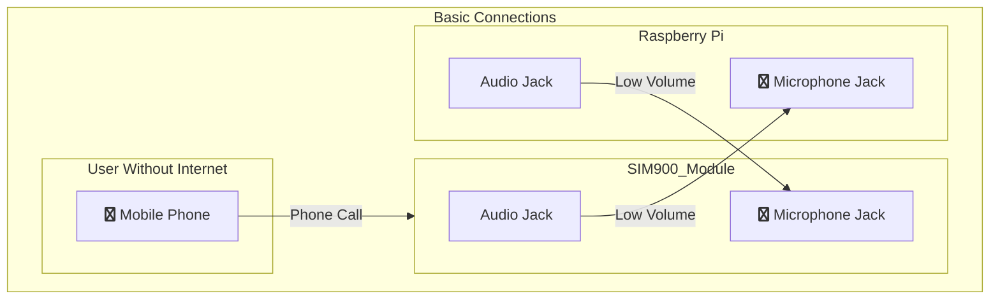
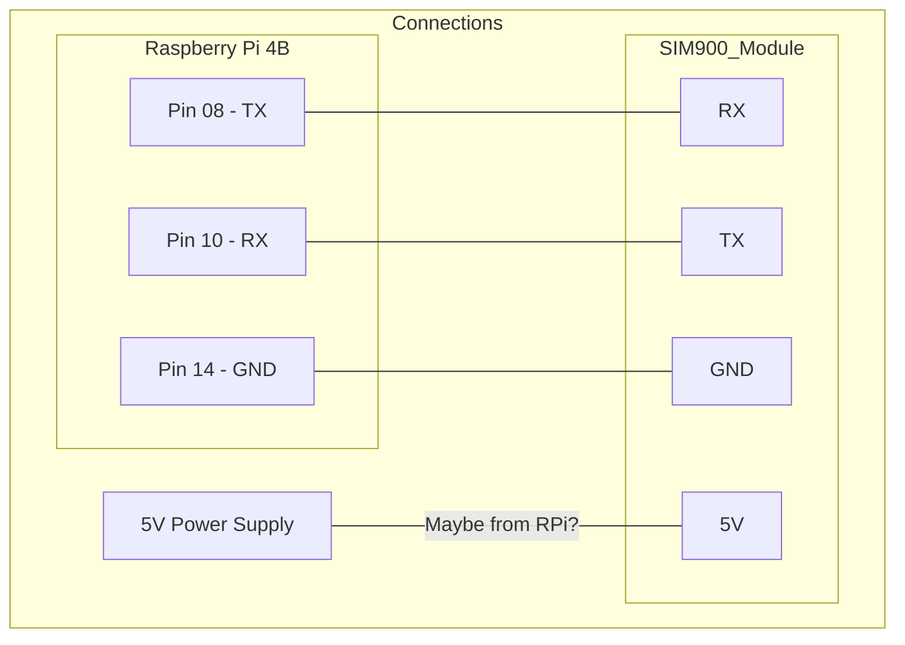

# Discord over Phone
Abstract: Call a phone number to speak in a Discord voice call. It will use a SIM900 module (to receive calls) which will be connected to a Raspberry Pi. The Raspberry Pi will then connect to a Discord voice channel and play the audio from the SIM900 module. The Raspberry Pi will also record the audio from the Discord voice channel and send it to the SIM900 module.

## Why?
Sometimes I lose internet connection on my phone, however calls still work. This is a problem because I get disconnected from Discord calls on my phone. The solution? Call a phone number which will relay the audio and mic both ways.

## How?
I'll be using a prepaid SIM card, which will be used by the [AliExpress SIM900 Module](https://aliexpress.com/item/32308127622.html) / [Wayback Machine URL](https://web.archive.org/web/20221012180515/https://www.aliexpress.us/item/2251832121812870.html?gatewayAdapt=esp2usa4itemAdapt&_randl_shipto=US).
A Raspberry Pi will be used to run Discord. Unfortunately, a Linux image with **desktop** (Raspberry Pi OS) will be used, as currently Discord's API doesn't allow receiving all user's audio in a single stream, and trying to merge them is a bit too complicated.

- A separate Discord account will be used on the Raspberry Pi. This account will be in a voicecall 24/7, and in order to not get into the AFK channel, it will get assigned a Discord Role which forbids it from connecting/seeing the AFK channel.
- The user will have to call the phone number that the SIM900 module is using.
- The SIM900's Audio output will be connected to the Raspberry Pi's Mic input.
- The Raspberry Pi's Audio output will be connected to the SIM900's Mic input.
> **`Important!`** The audio output volume on both devices will have to be set to a very low volume or the components could get fried. Here's a [Reddit thread](https://www.reddit.com/r/diyelectronics/comments/xknfgu/looking_for_cabledevice_that_turns_audio_output/) which discusses on this topic. The answers recommend a `speaker to line level converter circuit`. This, essentially, is a voltage divider. Therefore my assumption is to just lower the volume and not have to build/buy such a circuit.

## Raspberry Pi to SIM900 Connections

## Development Notes

- First I'm going to try the setup on a Raspberry Pi 3B+. If it works, I'll try it on my 24/7 running Raspberry Pi 4B 4GB.
- Why Raspberry Pi OS and not a more lightweight distro? Because currently my RPi is running [Tailscale](https://tailscale.com/), [Pi-hole](https://pi-hole.net/), and [PiVPN](https://www.pivpn.io/). They run without a problem on Raspberry Pi without desktop, so I'll be using that OS.
  - Flash SD card with [Raspberry Pi Imager](https://www.raspberrypi.com/software/). While in settings, activate SSH and set up the WiFi credentials.
  - Connect to the Raspberry Pi via SSH. You should have set up the username and password using the Raspberry Pi Imager.
  - Compulsory `sudo apt-get update && sudo apt-get upgrade -y` after first boot.
  - Activate VNC through SSH with `sudo raspi-config` > `Interfacing Options` > `VNC` > `Yes`.
  - Download [VNC Viewer](https://www.realvnc.com/es/connect/download/viewer/) and connect to the Raspberry Pi.
  - Download Discord using Pi-Apps:
    - `wget -qO- https://raw.githubusercontent.com/Botspot/pi-apps/master/install | bash`
    - Pi-Apps on your desktop > Search > "Discord" > Install
    - App will now be in the menu > Internet > `WebCord`
    - > Technically this Discord launcher violates TOS. A different solution is to use the web version of Discord (https://discord.com/login).
    - Make sure to go to `File` > `Settings` and turn on mic permissions on WebCord. 
- Turns out the RPi 3B+ doesn't have mic input through the jack :( Lets hope the RPi 4 has a jack with input capabilities. ~~I'm going to simulate an input using [Pulsemeeter](https://pypi.org/project/pulsemeeter/).~~ Nope, doesn't work, some extra packages have to be installed and I can't be bothered. I'll just simulate a dummy input using `sudo modprobe snd-dummy` (Will disappear after reboot).
- Now let's make WebCord start on boot
  - Create a cronjob with `crontab -e`
    - If it's the first time, it will ask you to select an editor. I chose nano (1).
  - Add line `@reboot DISPLAY=:0 webcord` to the end of the file. 
    - You might have to change DISPLAY=:0 to DISPLAY=:1 if it doesn't work. You can check the display number by writing `echo $DISPLAY` in the terminal.
  - Save file `ctrl + x` > `y` > `enter`
  - Reboot and make sure it works: `sudo reboot`
- Let's connect the cables. This time we will be using the RPi as the VCC 5V Power source. Same diagram as before, but using the 5V PIN to power the module. The RPi 3B+ has a different pinout: GPIO-14-TX to SIM900-RX and GPIO-15-RX to SIM900-TX.
- Enable serial communication:
  - Start raspi-config: `sudo raspi—config`.
  - Select option: `Interfacing Options`.
  - Select option  - `Serial Port`
  - At the prompt: Would you like a login sheII to be access±ble over serial?
  answer `No`
  - At the prompt: Would you like the serial port hardware to be enabled? answer `Yes`
  - Exit raspi-config and reboot the Pi for changes to take effect
  answer
- Use minicom to communicate with the module
  - Install `minicom` with `sudo apt-get install minicom`
  - Use minicom with `sudo minicom -D /dev/ttyS0 -b 115200`. (Still not clear if ttyS0 or ttyAMA0)
  - Write a command and press `ctrl+m`. If you get a response, it means that the module is working. If you write and it doesnt display text, still press `ctrl+m` and it should display the response.
  - To exit minicom, press `ctrl+a` and then `q`.
- Let's write a program to communicate with the module. This file here: ~~[communicate.py](communicate.py)~~ (Still not uploaded)
- Currently there is no communication between both devices. Neither with minicom or with the file. Maybe wrong connections?

## Useful SIM900 Info
> Source: https://simcom.ee/documents/SIM900/SIM900_AT%20Command%20Manual_V1.11.pdf
- Baud Rate: 115200
- Only enter AT Command through serial port after SIM900 is powered on and Unsolicited Result Code "RDY" is received from serial port. 
- These AT commands have the format of `"AT<x><n>"`, or `"AT&<x><n>"`, where `"<x>"` is the Command, and `"<n>"` is/are the argument(s) for that Command. `"<n>"` is optional and a default Will be used if missing.
- The Command line buffer can accept a maximum of 556 characters. If the characters entered exceeded this number, then none of the Command Will executed and TA Will return "ERROR".
- When you need to enter a series of AT commands on separate lines, please note that you need to wait the final response (for example OK, CME error, CMS error) of the last AT Command you entered before you enter the next AT Command.
- The "AT" or "at" prefix must be set at the beginning of each Command line. To terminate command line, enter `<CR>`.

| Name              | Command        | Description                                                                                                                             |
|-------------------|----------------|-----------------------------------------------------------------------------------------------------------------------------------------|
| Test Command      | `AT+<x>=?`     | The mobile equipment returns the list of parameters and value ranges set with the corresponding Write Command or by internal processes. |
| Read Command      | `AT+<x>?`      | This command returns the currently set value of the parameter or parameters.                                                            |
| Write Command     | `AT+<x>=<...>` | This command sets the user-definable parameter values.                                                                                  |
| Execution Command | `AT+<x>`       | The execution command reads non-variable parameters affected by internal processes in the GSM engine.                                   |                            |                |

### Useful commands
- `AT+CPIN?` - NEEDS PIN?
- `AT+CPIN=1234` - ENTER PIN
- `ATD+<phone number>` - MAKE A VOICECALL
- `ATA` - ANSWER CALL
- `ATH` - HANG UP
- `AT+CLCC` - LIST CURRENT CALLS OF ME